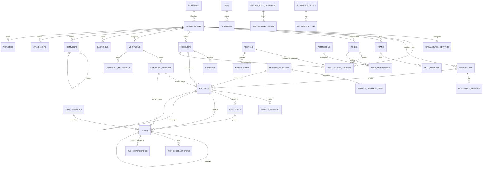

# FlowDesk — Multi-Tenant Database Design (v2)

**37 tables · 96 RLS policies · 35 permissions · 11 system roles · 4 storage buckets**
Validated end-to-end against a real Postgres engine — 32/32 checks pass.

> **Supersedes** the v1 single-tenant schema (archived in `supabase/legacy/v1-single-tenant/`).
> v2 is industry-agnostic and multi-organization from day one.

---

## 1 · ERD

## 2 · Complete table list

### Tenancy & identity (9)
| Table | Purpose |
|---|---|
| `industries` | System lookup. Drives default workflows, templates and terminology. |
| `profiles` | Application identity, 1:1 with `auth.users`. **Global** — one human, many organizations. |
| `organizations` | **Tenant root.** Every tenant-owned row carries `organization_id`. |
| `organization_settings` | Per-tenant config: timezone, capacity, health tolerance, **terminology**, feature flags. |
| `organization_members` | The tenancy anchor. Carries role, status, and `member_type` (member/guest). |
| `workspaces` | Subdivision of an org — department, office, portfolio, product line. |
| `workspace_members` | Workspace-scoped role assignment. |
| `teams` | Durable people groups, orthogonal to projects. |
| `team_members` | Team membership. |

### Access control (4)
| Table | Purpose |
|---|---|
| `permissions` | System catalogue of 35 capability keys (`project.update`, `task.update.own`, …). |
| `roles` | System roles (`organization_id IS NULL`) **and** tenant-defined custom roles. Scoped org/workspace/project. |
| `role_permissions` | Role → permission grants. |
| `invitations` | Tokenised onboarding for members and guests. |

### Configurable workflows (3)
| Table | Purpose |
|---|---|
| `workflows` | Per-tenant status machine, for `project` or `task` entities. |
| `workflow_statuses` | Tenant-named statuses, each mapped to a stable `status_category` + optional `auto_progress`. |
| `workflow_transitions` | Legal moves, optionally gated by a permission and/or requiring a comment. |

### Templates (3)
| Table | Purpose |
|---|---|
| `project_templates` | Reusable project shapes; system templates shared by all tenants. |
| `project_template_tasks` | Date-**relative** task blueprints (offsets, not dates), nestable, role-assigned. |
| `task_templates` | Single reusable task/SOP definitions with checklists. |

### External parties (2)
| Table | Purpose |
|---|---|
| `accounts` | The external party — client, customer, patient, contractor, agency, citizen body. |
| `contacts` | People at an account; optionally linked to a login (`profiles`) for guest access. |

### Work management (8)
| Table | Purpose |
|---|---|
| `projects` | The work container and **primary security boundary**. Supports sub-projects and 3 visibility levels. |
| `project_members` | Per-project role assignment (lead / contributor / reviewer / viewer). |
| `milestones` | Coarse checkpoints — always guest-visible. |
| `tasks` | Atomic work unit. Unlimited subtask nesting via `parent_id`. Highest write volume. |
| `task_dependencies` | Predecessor/successor links with 4 dependency types + lag. |
| `task_checklist_items` | Sub-steps without task sprawl. |
| `tags` | Free-form tenant labels. |
| `taggables` | Polymorphic tag attachment. |

### Collaboration & audit (4)
| Table | Purpose |
|---|---|
| `comments` | Polymorphic discussion; `is_internal` hides threads from guests. One-level replies. |
| `attachments` | File **metadata**; bytes live in Storage. `is_guest_visible` gates client downloads. |
| `activities` | Append-only audit trail, written **only by triggers**. `action` is TEXT for extensibility. |
| `notifications` | Per-user inbox. |

### Extensibility (4)
| Table | Purpose |
|---|---|
| `custom_field_definitions` | Tenant-defined fields on any entity; scoped org → workspace → project. |
| `custom_field_values` | Typed JSONB values, validated by trigger, GIN-indexed. |
| `automation_rules` | WHEN *trigger* IF *conditions* THEN *actions*. Stored now, engine later. |
| `automation_runs` | Execution log. |

## 3 · Relationship & cardinality map

| Parent | Child | Cardinality | On delete |
|---|---|---|---|
| organizations | workspaces, teams, accounts, workflows, roles | 1→N | CASCADE |
| organizations | organization_members | 1→N | CASCADE |
| profiles | organization_members | 1→N | CASCADE |
| workspaces | projects | 1→N | CASCADE |
| accounts | projects | 1→N | SET NULL |
| projects | tasks, milestones, project_members | 1→N | CASCADE |
| projects | projects (parent_id) | 1→N | CASCADE |
| tasks | tasks (parent_id) | 1→N | CASCADE |
| tasks | task_checklist_items | 1→N | CASCADE |
| tasks ↔ tasks | task_dependencies | N↔N | CASCADE |
| workflows | workflow_statuses, workflow_transitions | 1→N | CASCADE |
| roles ↔ permissions | role_permissions | N↔N | CASCADE |
| custom_field_definitions | custom_field_values | 1→N | CASCADE |

**Tenancy chain:** `organization → workspace → project → task`
**Denormalisation rule:** every tenant-owned table stores `organization_id` directly, and project-bound tables also store `project_id`. RLS then isolates with **one indexed predicate** instead of walking a join chain. Triggers derive these columns from the parent so a client can never spoof them.

## 4 · Migration files

| File | Contents |
|---|---|
| `0001_extensions_enums.sql` | 13 enum types |
| `0002_tenancy_rbac.sql` | Identity, organizations, workspaces, teams, roles, permissions, invitations |
| `0003_workflows_templates.sql` | Workflows, statuses, transitions, project/task templates |
| `0004_work_management.sql` | Accounts, contacts, projects, tasks, milestones, dependencies, tags |
| `0005_collaboration_extensibility.sql` | Comments, attachments, activities, notifications, custom fields, automation |
| `0006_functions.sql` | Access helpers, domain logic, tenant bootstrap, template instantiation |
| `0007_triggers.sql` | Audit stamping, tenancy derivation, task numbering, progress rollup, activity logging |
| `0008_rls.sql` | 82 policies + grants |
| `0009_storage.sql` | 4 buckets + 14 storage policies |
| `0010_seed.sql` | Industries, permissions, system roles, starter templates |

Apply in numeric order (Supabase SQL editor or `supabase db push`).

## 5 · RLS model

Evaluated in this order:

1. **Tenant** — `is_org_member(organization_id)`. Nothing crosses tenants, ever.
2. **Scope** — `can_view_project()` resolves visibility:
   - explicit project membership → visible
   - guest whose `account_id` matches the project's → visible
   - member + `visibility='organization'` → visible
   - member + `visibility='workspace'` + workspace member → visible
   - member holding `project.view.all` → visible
3. **Sensitivity** — guests never see `is_internal` comments, unshared files, hours, or automation.
4. **Capability** — every write calls `has_permission(org, key, workspace, project)`, which unions the caller's **organization + workspace + project** role grants.

All helpers are `SECURITY DEFINER` (breaks RLS recursion) and `STABLE` (evaluated once per statement, not once per row — the difference between fast and unusable).

## 6 · Database functions (21)

**Access:** `is_org_member` · `is_org_guest` · `is_workspace_member` · `is_project_member` · `has_permission` · `can_view_project` · `can_view_task` · `can_edit_task` · `can_see_internal` · `can_view_profile`

**Domain:** `status_category_of` · `recompute_project_progress` (effort-weighted) · `compute_project_health` · `is_transition_allowed` · `notify_user` · `log_activity`

**Operations:** `bootstrap_organization` (atomic tenant creation) · `create_default_task_workflow` (industry-aware) · `instantiate_project_template` (two-pass, preserves nesting) · `soft_delete_project` (cascading) · `generate_deadline_notifications` (cron)

## 7 · Triggers

| Trigger | Guarantee |
|---|---|
| `handle_new_user` | Every auth user gets a profile |
| `set_audit_fields` / `set_created_audit` | Audit columns can never be forgotten (applied to 30 tables) |
| `projects_before_write` | Project org **always** follows its workspace — tenancy cannot be spoofed |
| `tasks_before_write` | Derives org/workflow/status, allocates task number atomically, validates transition, applies status-driven progress/completion/blocked state |
| `tasks_after_write` | Recomputes project progress, logs activity, sends notifications |
| `derive_org_from_project` / `_task` | Child rows inherit tenancy from their parent |
| `comments_after_insert` | Activity + @mention notifications |
| `attachments_after_insert` | Activity trail |
| `validate_custom_field_value` | Enforces the declared field type at write time |
| `prevent_last_owner_removal` | An organization can never lose its last owner |

## 8 · Storage buckets

| Bucket | Public | Limit | Path convention |
|---|---|---|---|
| `avatars` | ✅ | 5 MB | `{user_id}/{uuid}-{file}` |
| `branding` | ✅ | 5 MB | `{organization_id}/{uuid}-{file}` |
| `attachments` | ❌ | 50 MB | `{organization_id}/{project_id}/{uuid}-{file}` |
| `exports` | ❌ | 100 MB | `{organization_id}/{uuid}-{file}` |

The **first path segment is the tenant key**; every private-bucket policy verifies membership of that organization, so a leaked path from one tenant is useless to another. Guest downloads use short-TTL signed URLs generated server-side after checking `is_guest_visible`.

## 9 · Seed data

System reference data only — **no fake tenants, users or demo projects**:
11 industries · 35 permissions · 11 system roles · role→permission grants · 3 starter project templates (Software Delivery, Marketing Campaign, Construction Handover) with 13 template tasks.

Idempotent — safe to re-run.

## 10 · Future extensibility notes

### Designed-in, ready to use
| Capability | How |
|---|---|
| **New industry** | Insert an `industries` row + a status set in `create_default_task_workflow`. No schema change. |
| **New terminology** | `organization_settings.terminology` JSONB — "Project"→"Site", "Task"→"Work Order". |
| **Custom role** | Insert `roles` + `role_permissions` scoped to the tenant. Policies already resolve dynamically. |
| **Custom workflow** | Tenant edits `workflow_statuses` / `workflow_transitions`. Progress and reporting keep working via `status_category`. |
| **Custom fields** | `custom_field_definitions` on any entity, any scope. |
| **New entity type** | Add a value to the `entity_type` enum — comments, attachments, tags and custom fields immediately support it. |
| **Automation** | `automation_rules` rows exist now; add an executor that reads `trigger_type` and applies `actions`. |

### Deliberately deferred (with the trigger to build them)
| Feature | Build when |
|---|---|
| `report_snapshots` rollups | Dashboards exceed ~1 s |
| `task_status_history` table | Cycle-time analytics get slow (derivable from `activities` today) |
| Partitioning `activities` / `tasks` | A table passes ~10 M rows |
| `pg_trgm` / `tsvector` search | `ILIKE` search becomes the bottleneck (it cannot use an index) |
| Per-field permissions | A tenant needs to hide a specific custom field from a role |
| Time tracking (`time_entries`) | Billing is required |
| Sprints (`iterations`) | A tenant runs Scrum |
| Billing/subscription tables | The platform is commercialised |

### Known trade-offs
1. **Polymorphic `entity`/`entity_id`** on comments/attachments/tags/custom values means **no FK integrity** on that pair. Mitigated by the denormalised `organization_id`/`project_id` (which *are* FK-enforced) and by trigger derivation. The alternative — a join table per entity type — would multiply tables and policies without adding real safety.
2. **EAV custom fields** are flexible but slower to query than native columns. The GIN index on `value` keeps filtering viable; move a field to a real column if a tenant filters on it constantly.
3. **`has_permission` unions three membership tables.** Fast because all are indexed and the function is `STABLE`, but it is the first thing to cache (materialised per-user permission set) if write throughput becomes an issue.
4. **Guest access is account-scoped.** A guest who must see projects across several accounts needs explicit `project_members` rows — intentional, so the default stays closed.
