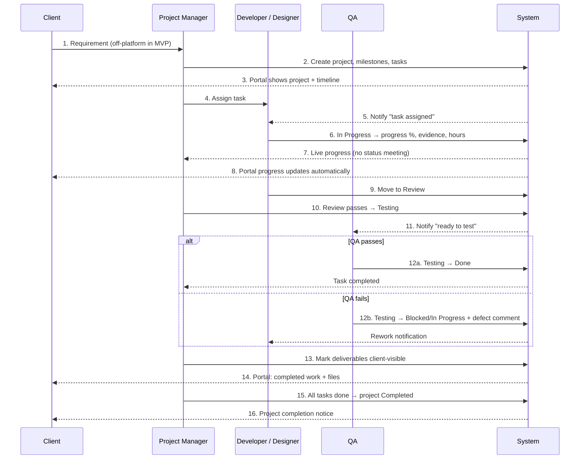
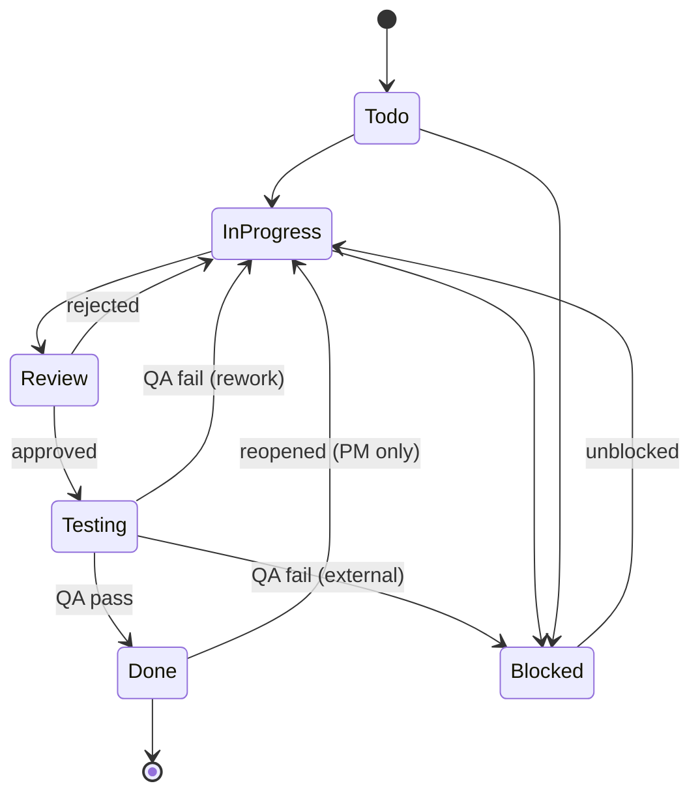

# FlowDesk — Product Requirement Document (PRD)

**Product:** FlowDesk — internal delivery management for an IT consultancy
**Scale target:** 100+ employees, ~40 concurrent projects, 10k+ tasks/year
**Status:** Blueprint (pre‑Phase‑2). Phase 1 (auth, roles, shell, schema) is implemented.

> This PRD covers **Sections 1–4, 9, 14** of the architecture brief.
> Technical design lives in [SDD.md](./SDD.md) (Sections 5–8, 10–13).

---

## ⚠️ Decisions requiring sign‑off

These change the Phase 1 data model. **Nothing is implemented until you approve.**

| # | Decision | Recommendation | Cost if approved |
|---|---|---|---|
| **D1** | Your flow needs **QA** and **Designer**, but Phase 1 has 4 flat roles | Split into **two axes**: a coarse *workspace role* + a per‑project *function* (`lead`/`developer`/`designer`/`qa`) | Small. `project_members.role` already exists as a free‑text column — it just becomes a constrained enum. Plus one new RLS rule so QA can act on tasks they aren't assigned. |
| **D2** | Workspace role `developer` would also label designers and QA | Rename to **`member`** | Enum rename. Free now (no production data); expensive later. |
| **D3** | "CEO" appears as a dashboard persona | CEO = `super_admin` role, with an **executive dashboard variant**. No new role. | None. |
| **D4** | Project progress is currently a **simple average** of task progress | Change to **effort‑weighted** average (see BR‑2) | Trigger logic change only. |
| **D5** | Clients currently cannot submit anything | Keep read‑only for MVP; add "Client Request Inbox" in roadmap | None now. |

### D1 explained — why two axes

A flat role list breaks at consultancy scale. Real situations it cannot express:

- Budi is **QA on Project A** but **Developer on Project B**.
- A designer needs developer‑level task rights, but "Developer" is the wrong job title on their profile.
- A senior dev is **Lead** on one project and an IC on three others.

Flat roles force either role explosion (`senior_dev_lead_qa`) or lying about job titles.

**The model:**

| Axis | Values | Answers | Changes per project? |
|---|---|---|---|
| **Workspace role** (on profile) | `super_admin`, `project_manager`, `member`, `client` | "What can you do in this company?" | No |
| **Project function** (on membership) | `lead`, `developer`, `designer`, `qa` | "What is your job on *this* project?" | Yes |

`super_admin` and `project_manager` are workspace‑wide. `member` grants nothing by itself — a member sees only projects they are a member of, and their **function** decides what they may do there. This is how Jira and Linear scale, and it is the single most important structural decision in this document.

---

# SECTION 1 — Business Flow

## 1.1 The loop



## 1.2 Every interaction, stage by stage

### Stage 1 — Intake (Client → PM)

- **MVP reality:** clients are **read‑only**. Requirements arrive off‑platform (call, email, meeting).
- The PM is the system of record: they translate the requirement into a Project and Tasks.
- **Information created:** project name, description, client link, start/end dates, PIC, colour, project key.
- **Why read‑only:** letting clients create tickets invites scope creep with no commercial gate. A "Client Request Inbox" with PM triage is roadmap (R‑09), not MVP.

### Stage 2 — Planning (PM)

- PM creates the **Project**, attaches the **Client** organisation, sets the window and the PIC.
- PM adds **project members** and assigns each a **function** (lead / developer / designer / QA).
- PM decomposes scope into **Tasks**: title, description, priority, estimate, start/due dates.
- **Client sees immediately:** project exists, its timeline, and 0% progress. Transparency starts at day zero.

### Stage 3 — Assignment (PM → Developer)

- PM sets `assignee`. System fires: **activity** (`task_assigned`) + **notification** to the assignee.
- Task sits in **Todo**. It now appears on the developer's *My Tasks*.
- **Rule:** one assignee per task (MVP). Shared work must be split into separate tasks — this keeps accountability unambiguous.

### Stage 4 — Execution (Developer / Designer)

The developer is the **only** source of truth for their own progress. They update:

| What | Why it matters |
|---|---|
| Status → In Progress | Tells PM work actually started (vs. assigned‑but‑untouched) |
| Progress % (0–100, steps of 10) | Feeds project progress → feeds client portal |
| Checklist items | Sub‑steps without task explosion |
| Actual hours | Estimate accuracy + workload truth |
| Evidence (screenshot, PR link, Figma, staging URL) | Lets PM/QA/client verify without asking |
| Internal comments | Discussion, blockers, decisions |

**Every one of these writes an activity record.** The activity log is the audit spine — it is what replaces "please give me an update" on WhatsApp.

### Stage 5 — Developer → Review

- Developer moves task to **Review** when they believe it is complete.
- The project **lead** or **PM** reviews (code review, design review).
- Outcomes: approve → **Testing**; reject → back to **In Progress** with a comment stating what is wrong.

### Stage 6 — QA

- QA member validates against the task description / acceptance criteria.
- QA is the **only** role (besides PM/admin) that may move a task **out of Testing** — this is the "Approve" permission in Section 3.
- **Pass →** `Done` (progress auto‑set to 100%).
- **Fail →** `In Progress` (rework) or `Blocked` (external dependency), **plus a mandatory defect comment**. A silent rejection is not allowed.

### Stage 7 — The Blocked path (can happen at any stage)

- Any assignee, QA, or PM may set **Blocked** with a reason.
- System notifies the PM immediately — blockers are the highest‑value signal a PM receives.
- Blocked tasks: stop accruing progress, surface on the PM dashboard, and after **3 days** degrade project health to `at_risk` (BR‑5).

### Stage 8 — PM verification & client packaging

- PM confirms completion and decides **what the client is allowed to see**:
  - flags selected attachments as **client‑visible** (default is internal‑only),
  - internal comments and hour data are **never** exposed.
- This is a deliberate curation step: raw internal chatter reaching a client is a commercial risk.

### Stage 9 — Client visibility (PM → Client)

The client portal answers three questions **without anyone writing a report**:

1. What is today's progress? → live project %, per‑task status
2. What has been completed? → completed task list + shared files
3. What is next? → current + upcoming tasks, timeline, milestones

### Stage 10 — Closure

- All tasks `Done` → project progress reaches 100%.
- PM sets project status **Completed** → notification to client and stakeholders.
- Project becomes read‑only history for reporting (retained, not deleted).

## 1.3 What flows through the system

| Flow | Direction | Carrier |
|---|---|---|
| Intent / scope | Client → PM | Project + Task records |
| Accountability | PM → Member | `assignee` + notification |
| Truth about progress | Member → System → everyone | `progress`, `status`, activity log |
| Verification | Member → QA → PM | Evidence fields + status transitions |
| Curated reality | PM → Client | `is_client_visible` flag, portal |
| Audit | Everything → activity log | Immutable, append‑only |

---

# SECTION 2 — User Journey

## 2.1 Super Admin (CEO / Operations)

| # | Step | What they see / do |
|---|---|---|
| 1 | Land on `/` | Redirect to `/login` (or setup screen if DB unconfigured) |
| 2 | Login | Email + password → Supabase session cookie |
| 3 | **First‑ever account** | Automatically becomes Super Admin (workspace bootstrap) |
| 4 | Executive dashboard | Portfolio health, projects at risk, overdue count, team utilisation, completion trend |
| 5 | Drill into a red project | Health reason, blocked tasks, who owns them, days slipped |
| 6 | Team | Full roster, roles, workload (free / balanced / overloaded) |
| 7 | Change a role | Promote member → PM; only Super Admin may do this |
| 8 | Clients | Create client org, invite client user, link to projects |
| 9 | Reports | Completion %, on‑time rate, estimate accuracy; export CSV |
| 10 | Workspace settings | Company name, logo, working hours, health thresholds |
| 11 | Global search ⌘K | Jump to any project/task |
| 12 | Logout | Session cleared, cookies revoked |

**Emotional job:** "Do I need to worry about anything today?" — answered in under 10 seconds.

## 2.2 Project Manager

| # | Step | What they see / do |
|---|---|---|
| 1 | Login | → PM dashboard |
| 2 | Triage | Blocked tasks, overdue tasks, tasks awaiting review — the PM's queue |
| 3 | Create project | Name, key, client, dates, colour, PIC |
| 4 | Staff it | Add members, assign **function** (lead/dev/designer/QA) |
| 5 | Break down work | Create tasks with priority, estimate, dates |
| 6 | Assign | Choose assignee → they get notified |
| 7 | Monitor | Kanban board, timeline, per‑developer workload |
| 8 | Unblock | Read blocker comment, reassign / escalate / change scope |
| 9 | Review | Approve Review → Testing, or bounce back |
| 10 | Curate for client | Toggle attachments client‑visible; verify portal reads correctly |
| 11 | Report | Weekly status auto‑derived; export |
| 12 | Close project | Set Completed → client notified |
| 13 | Logout | |

**Emotional job:** "Stop being a human status‑API."

## 2.3 Developer / Designer / QA (`member`)

| # | Step | What they see / do |
|---|---|---|
| 1 | Login | → **My Tasks** (not a portfolio dashboard — they need work, not analytics) |
| 2 | See the day | Four buckets: **Overdue** · **Today** · **Tomorrow** · **Upcoming**, plus Completed today |
| 3 | Start work | Task → In Progress |
| 4 | Work the checklist | Tick sub‑items |
| 5 | Update progress | 0–100 in steps of 10 |
| 6 | Log hours | Actual hours vs estimate |
| 7 | Attach evidence | Screenshot, PR link, Figma, staging URL |
| 8 | Discuss | Internal comments, @mention teammates |
| 9 | Hit a wall | Set **Blocked** + reason → PM notified |
| 10 | Finish | Move to **Review** |
| 11 | *(QA function)* | Pull from **Testing**, verify, pass → Done / fail → back with defect |
| 12 | Logout | |

**Constraints they feel:** cannot edit project settings, cannot reassign their own task, cannot change estimates or due dates (PM‑owned), cannot see other people's salary‑adjacent data.

**Emotional job:** "What should I do today, and what's due tomorrow?"

## 2.4 Client

| # | Step | What they see / do |
|---|---|---|
| 1 | Login | → Client portal (a **different shell**, not the internal app) |
| 2 | Project overview | Progress ring, health, timeline window, PIC contact |
| 3 | Progress detail | Completed / in‑progress / upcoming tasks — titles, status, dates |
| 4 | Timeline | Visual schedule + milestones |
| 5 | Files | Download **only** files explicitly shared with them |
| 6 | Recent updates | Curated activity (status changes, completions, shared files) |
| 7 | Logout | |

**Hard walls:** no create, no edit, no delete, no internal comments, no hours/estimates, no other clients' data, no team roster beyond assignee names.

**Emotional job:** "Stop having to chase them on WhatsApp."

---

# SECTION 3 — Role Permission Matrix

**Legend:** `C` Create · `R` Read · `U` Update · `D` Delete · `A` Approve · `E` Export · `—` no access

**Scope qualifiers:** `(all)` workspace‑wide · `(proj)` projects they belong to · `(own)` records they authored · `(asgn)` tasks assigned to them · `(vis)` client‑visible only

> Developer, Designer and QA share the workspace role **`member`**; the differences below come from their **project function** (Decision D1).

## 3.1 Master matrix

| Feature | Super Admin | Project Manager | Developer | Designer | QA | Client |
|---|---|---|---|---|---|---|
| **Dashboard** | R (all) | R (all) | R (own) | R (own) | R (own) | R (vis) |
| **Projects** | C R U D E | C R U D E | R (proj) | R (proj) | R (proj) | R (vis) |
| **Project members** | C R U D | C R U D | R (proj) | R (proj) | R (proj) | — |
| **Clients** | C R U D E | C R U D | — | — | — | R (own org) |
| **Tasks** | C R U D E | C R U D E | R (proj) U (asgn) | R (proj) U (asgn) | R (proj) U (asgn) | R (vis) |
| **Task status → Testing** | U | U | U (asgn) | U (asgn) | U (asgn) | — |
| **Task status Testing → Done** | U A | U A | — | — | **U A (proj)** | — |
| **Task assignment** | U | U | — | — | — | — |
| **Task dates / estimates** | U | U | — | — | — | — |
| **Task progress / hours** | U | U | U (asgn) | U (asgn) | U (asgn) | — |
| **Checklists** | C R U D | C R U D | C R U D (asgn) | C R U D (asgn) | C R U D (asgn) | — |
| **Files / Attachments** | C R U D | C R U D A | C R (proj) D (own) | C R (proj) D (own) | C R (proj) D (own) | **R (vis)** |
| **Mark file client‑visible** | U | U | — | — | — | — |
| **Comments** | C R U(own) D | C R U(own) D | C R U(own) D(own) | C R U(own) D(own) | C R U(own) D(own) | — |
| **Timeline** | R E | R E | R (proj) | R (proj) | R (proj) | R (vis) |
| **Calendar** | R | R | R (own) | R (own) | R (own) | — |
| **Activity log** | R E | R (proj) | R (proj) | R (proj) | R (proj) | R (vis, filtered) |
| **Notifications** | R U (own) | R U (own) | R U (own) | R U (own) | R U (own) | R U (own) |
| **Reports** | R E | R E (proj) | — | — | — | — |
| **Analytics** | R E | R (proj) | — | — | — | — |
| **Client Portal (view as)** | R | R | — | — | — | R (own) |
| **Team / Members** | C R U D | R | — | — | — | — |
| **Change user roles** | **U** | — | — | — | — | — |
| **Workspace settings** | R U | — | — | — | — | — |

## 3.2 Permission notes that matter

1. **Only QA (or PM/Admin) may approve out of Testing.** This is the single "Approve" gate in the product and the reason QA must exist as a function.
2. **Only PM/Admin may set dates, estimates and assignment.** Members owning their own deadlines destroys planning integrity.
3. **Only PM/Admin may mark a file client‑visible.** Default is internal.
4. **Only Super Admin may change roles.** Prevents privilege escalation by PMs.
5. **Clients have zero write permissions anywhere.** Not "hidden buttons" — enforced in the database (see SDD §11).
6. **`member` alone grants nothing.** Access derives from project membership. A member on no projects sees an empty app.

---

# SECTION 4 — Business Rules

## BR‑1 · Task progress

- Range **0–100**, in increments of **10**.
- Owned by the **assignee** (or PM/Admin).
- `status = Done` ⇒ progress **forced to 100**.
- progress = 100 does **not** auto‑complete the task — completion is a human/QA decision.
- `Blocked` tasks retain their progress but stop accruing.

## BR‑2 · Project progress *(changed — D4)*

**Current (Phase 1):** simple mean of task progress.
**Problem:** a 40‑hour task counts the same as a 1‑hour task, so progress lies.

**New formula — effort‑weighted:**

```
project_progress = Σ(task_progress_i × weight_i) / Σ(weight_i)

weight_i = estimated_hours_i   (default 1 when null)
```

- Rounded to nearest integer, clamped 0–100.
- Recomputed whenever any task is inserted, updated or deleted.
- A project with **no tasks** is 0%.
- Cancelled/removed tasks are excluded.

## BR‑3 · Overdue

| Entity | Overdue when |
|---|---|
| Task | `due_date < today` **AND** `status ≠ Done` |
| Project | `end_date < today` **AND** `progress < 100` **AND** `status ∉ {Completed, Cancelled}` |

- Evaluated in **workspace timezone**, not UTC — an 8‑hour offset silently mislabels a day's work.
- `Blocked` tasks still count as overdue (a blocker is not an excuse the client sees).

## BR‑4 · Blocked

- Setting `Blocked` **requires a reason comment**. Enforced at the service layer.
- Notifies: PM + project lead, immediately.
- Blocked tasks are excluded from "active work" counts.
- **Blocked > 3 consecutive days** ⇒ contributes `at_risk` to project health.
- Only PM/Admin, the assignee, or QA may set/clear Blocked.

## BR‑5 · Project health

```
elapsed_ratio    = (today − start_date) / (end_date − start_date)
expected_progress = clamp(elapsed_ratio × 100, 0, 100)
```

Evaluated in order (first match wins):

| Result | Condition |
|---|---|
| `on_track` | status ∈ {Completed, Cancelled} — terminal |
| `on_track` | no `end_date` set (cannot judge) |
| **`delayed`** | `today > end_date` AND `progress < 100` |
| **`at_risk`** | `progress < expected_progress − 15` |
| **`at_risk`** | any task blocked > 3 days |
| **`at_risk`** | overdue task count > 0 |
| `on_track` | otherwise |

- The **15‑point tolerance** is a workspace setting, not a hard‑coded constant.
- Health is **derived, never stored** — storing it guarantees staleness.

## BR‑6 · Developer productivity

> ⚠️ **Ethical guard‑rail:** these are *workload and planning* signals. They must never be presented as a ranked leaderboard or used as the sole input to performance review. Consultancy work varies wildly in difficulty.

| Metric | Formula |
|---|---|
| Throughput | tasks moved to Done in period |
| On‑time rate | on‑time completions ÷ total completions |
| Estimate accuracy | Σ estimated_hours ÷ Σ actual_hours (1.0 = perfect) |
| Cycle time | mean(Done timestamp − first In‑Progress timestamp) |
| WIP | count of tasks currently In Progress |

**Workload / capacity:**

```
remaining_effort = Σ over open assigned tasks of
                   estimated_hours × (100 − progress) / 100

utilisation = remaining_effort / weekly_capacity_hours   (default 40)
```

| Band | Utilisation | Meaning |
|---|---|---|
| 🟢 Free | < 0.5 | Can take work |
| 🔵 Balanced | 0.5 – 1.0 | Healthy |
| 🟡 Heavy | 1.0 – 1.5 | Watch |
| 🔴 Overloaded | > 1.5 | Reassign now |

## BR‑7 · Timeline rules

- `start_date ≤ due_date` — hard validation.
- Task dates outside the project window ⇒ **warning, not a block** (reality overruns plans).
- A task with no dates does not appear on the timeline; it lives in the backlog.
- Default task duration when only a due date is given: **1 day**.
- Milestones are date markers owned by the PM and are **always client‑visible**.
- Task **dependencies** are explicitly out of MVP (roadmap R‑10).

## BR‑8 · Client visibility

A client may read a project **iff** `project.client_id` = their organisation.

| Client CAN see | Client CANNOT see |
|---|---|
| Project name, description, dates, progress, health | Internal comments (any) |
| Task title, status, priority, dates, progress | Estimated / actual hours |
| Assignee display name + avatar | Team roster beyond assignees |
| Milestones and timeline | Internal‑only attachments |
| Attachments flagged **client‑visible** | Activity of type `comment_added` |
| Curated recent updates | Other clients' anything |

**Hours are hidden deliberately** — they expose margin and invite rate renegotiation.

## BR‑9 · Attachment rules

| Rule | Value |
|---|---|
| Allowed types | PDF, DOC/DOCX, XLS/XLSX, ZIP, PNG/JPG/GIF/WEBP, TXT |
| Max size (attachments) | 25 MB |
| Max size (avatars) | 5 MB |
| Storage | Private bucket; **signed URLs only**, short TTL |
| Default visibility | **Internal** (`client_visible = false`) |
| Who may flag client‑visible | PM / Super Admin only |
| Who may delete | Uploader, or PM / Super Admin |
| Path convention | `{project_id}/{task_id}/{uuid}-{filename}` |
| Virus scanning | Roadmap (R‑13) |

## BR‑10 · Comment rules

- Comments are **internal by default and in MVP always internal**. Clients can neither read nor write them.
- Threading: **one level** (comment → replies). Deeper nesting is unreadable on mobile.
- Author may edit/delete their own; PM/Admin may delete any (moderation).
- Editing sets `updated_at`; the original is **not** silently replaced in the activity log.
- `@mention` notifies the mentioned user, provided they can already see the task.
- Comments never alter task state — a comment saying "done" does not complete anything.

## BR‑11 · Notification rules

| Trigger | Recipient |
|---|---|
| Task assigned / reassigned | New assignee |
| Task moved to Testing | Project QA members |
| Task completed | Reporter + project PIC |
| Task blocked | PM + project lead |
| Deadline today | Assignee |
| Deadline tomorrow | Assignee |
| Project completed | PIC + client user(s) |
| @mention | Mentioned user |

- **Never self‑notify** — the actor is always excluded.
- Deadline notifications are generated by a **scheduled daily job**, de‑duplicated per task per day.
- Notifications are per‑user readable only; unread count drives the topbar badge.
- Retention: 90 days, then purged.
- Email/Slack delivery is **out of MVP** (roadmap R‑06/R‑07) — in‑app only.

## BR‑12 · Status transitions



| Transition | Who may perform |
|---|---|
| Todo ↔ In Progress ↔ Review | Assignee, PM, Admin |
| Review → Testing | Lead, PM, Admin |
| **Testing → Done / In Progress / Blocked** | **QA function**, PM, Admin |
| any → Blocked | Assignee, QA, PM, Admin (**reason required**) |
| Done → In Progress (reopen) | PM, Admin only |

## BR‑13 · Assignment

- **Exactly one assignee** per task (MVP). Split work rather than share a task.
- Reassignment notifies the new assignee; the previous assignee's history is preserved in the activity log.
- Unassigned tasks live in the project backlog and are excluded from workload maths.
- Only PM/Admin assign.

## BR‑14 · Identifiers

- Each project may define a **key** (2–6 uppercase chars, e.g. `WEB`).
- Tasks receive a **per‑project running number**, displayed as `WEB‑42`.
- Both are **immutable** once created — they end up in commit messages and client emails.

## BR‑15 · Deletion & retention

- Completed projects are **never hard‑deleted** — they are reporting history.
- Deleting a project cascades to its tasks/comments/attachments; storage objects are cleaned by a background job.
- Deleting a **user** preserves their authored records (author becomes null) — audit integrity outranks tidiness.
- Soft‑delete/archive for projects: roadmap (R‑12).

---

# SECTION 9 — Dashboard Widgets

Every dashboard obeys one rule: **the top row must answer the role's core anxiety within 10 seconds.**

## 9.1 CEO / Super Admin — "Do I need to worry?"

| Widget | Content | Why |
|---|---|---|
| **Portfolio KPI row** | Active · Completed · Overdue · At‑risk project counts | The 10‑second answer |
| **Projects needing attention** | Only `delayed` + `at_risk`, sorted by severity, with the *reason* | Exceptions, not a list of everything |
| **Portfolio health donut** | On‑track / at‑risk / delayed split | Trend of the whole business |
| **Team utilisation** | Members bucketed free / balanced / heavy / overloaded | Hiring and rebalancing decisions |
| **Completion trend** | Tasks completed per week, 8‑week sparkline | Is throughput improving? |
| **Client exposure** | Projects grouped by client, with health | Which relationships are at risk |
| **Recent activity** | Workspace‑wide feed, 10 items | Pulse |

Deliberately **absent:** individual task lists. A CEO drowning in tasks is a broken dashboard.

## 9.2 Project Manager — "What needs me today?"

| Widget | Content |
|---|---|
| **My triage queue** | Blocked tasks · overdue tasks · awaiting review — the PM's actual to‑do list |
| **My projects** | Cards: progress ring, health, client, deadline, member avatars |
| **Workload board** | Each member vs capacity, with overload flags |
| **Deadlines this week** | Tasks + milestones due within 7 days |
| **Unassigned tasks** | Backlog items nobody owns |
| **Awaiting QA** | Tasks sitting in Testing, with age |
| **Recent activity** | Scoped to their projects |

## 9.3 Developer / Designer / QA — "What do I do now?"

This is **My Tasks**, not an analytics page.

| Widget | Content |
|---|---|
| **Overdue** 🔴 | Past due, incomplete — always first |
| **Today** | Due today |
| **Tomorrow** | Due tomorrow |
| **Upcoming** | Next 7 days |
| **In Progress** | Their current WIP, with progress sliders |
| **Completed today** | Small win reinforcement |
| **My load** | Remaining effort vs capacity |
| **Awaiting my QA** *(QA function)* | Tasks in Testing on their projects |
| **Mentions** | Comments that @mention them |

## 9.4 Client — "Where are we?"

| Widget | Content |
|---|---|
| **Progress hero** | Big progress ring + health badge + days remaining |
| **Milestone timeline** | Visual schedule, achieved vs upcoming |
| **Completed recently** | Last 10 finished items — proof of motion |
| **In progress now** | What is being worked on today |
| **Coming next** | Upcoming scheduled work |
| **Shared files** | Downloadable deliverables |
| **Project contact** | PIC name, avatar, email |

Deliberately **absent:** hours, costs, internal discussion, team roster, other clients.

---

# SECTION 14 — Future Roadmap (excluded from MVP)

Ordered by expected value ÷ effort. Each is excluded **on purpose** — MVP must ship.

## Horizon 1 — Next (right after Phase 5)

| # | Feature | Why excluded from MVP | Why it's next |
|---|---|---|---|
| R‑01 | **Email notifications** | Requires deliverability, templates, unsubscribe | In‑app alone is missed by people not logged in |
| R‑02 | **Time tracking (timer + timesheets)** | MVP uses manual `actual_hours` | Consultancy billing runs on this |
| R‑03 | **Sprints / iterations** | Adds a whole planning layer | Teams doing Scrum will demand it |
| R‑04 | **Client Request Inbox** | Clients read‑only in MVP | Closes the loop; removes email intake |
| R‑05 | **Saved views & filters** | Nice‑to‑have | Big usability win at 40+ projects |

## Horizon 2 — Later

| # | Feature | Note |
|---|---|---|
| R‑06 | **Slack integration** | Deadline/blocker alerts into channels |
| R‑07 | **GitHub integration** | Auto‑link PRs, move task on merge |
| R‑08 | **Task dependencies + critical path** | Real Gantt semantics |
| R‑09 | **Recurring tasks & project templates** | Consultancies repeat project shapes |
| R‑10 | **Capacity planning / forecasting** | "Can we take this project?" |
| R‑11 | **Custom fields** | Per‑client metadata |
| R‑12 | **Archive / soft delete + restore** | Safety net |
| R‑13 | **Virus scanning on upload** | Security hardening |
| R‑14 | **Audit log export** | Compliance |

## Horizon 3 — Someday

| # | Feature | Note |
|---|---|---|
| R‑15 | **AI assistant** | Summarise project status, draft client updates, suggest estimates from history |
| R‑16 | **OCR for PDFs** | Extract text from scanned client documents |
| R‑17 | **Mobile app** (React Native) | Responsive web covers MVP |
| R‑18 | **Public API + webhooks** | Ecosystem |
| R‑19 | **SSO / SAML** | Enterprise clients |
| R‑20 | **Multi‑tenant white‑label** | Only if FlowDesk becomes a sold product (see SDD §13) |
| R‑21 | **Invoicing / billing** | Hours → invoice |
| R‑22 | **i18n (Bahasa Indonesia + English)** | Wider rollout |

## Explicitly rejected (not "later" — *no*)

| Feature | Reason |
|---|---|
| Per‑developer public leaderboard | Corrodes collaboration; gamifies the wrong thing |
| Client‑visible hour logs | Exposes margin, invites rate disputes |
| Screenshot/keystroke surveillance | Ethically indefensible; destroys trust |
| Unlimited comment nesting | Unreadable on mobile |
