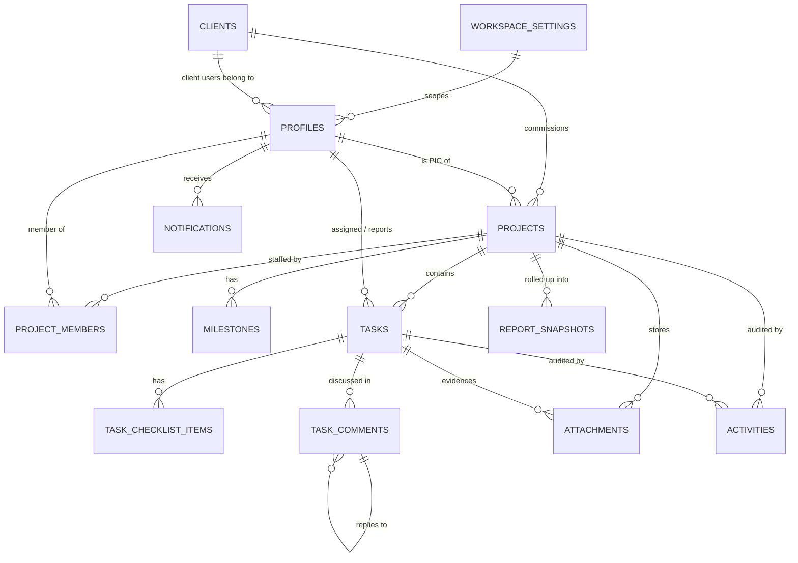

# FlowDesk — Software Design Document (SDD)

**Stack:** Next.js 15 (App Router) · React 19 · TypeScript · Tailwind v4 · shadcn/ui · Supabase (Postgres + Auth + Storage) · Vercel

> This SDD covers **Sections 5–8, 10–13** of the architecture brief.
> Product requirements live in [PRD.md](./PRD.md) (Sections 1–4, 9, 14).

---

# SECTION 5 — Database Planning (conceptual)

> No SQL. Entities, purpose, relationships and lifecycle only.

## 5.1 Entity–relationship overview



## 5.2 Mapping your entity list → this design

| You listed | This design | Note |
|---|---|---|
| `users` | **`profiles`** (+ Supabase‑managed `auth.users`) | Credentials stay in Supabase Auth; app data in `profiles` |
| `companies` | **`workspace_settings`** | Single‑company MVP; becomes `organizations` only if multi‑tenant (§13) |
| `clients` | **`clients`** | Client *organisations*, not client users |
| `projects` | **`projects`** | — |
| `project_members` | **`project_members`** | Gains a **function** enum (PRD D1) |
| `tasks` | **`tasks`** | — |
| `task_comments` | **`task_comments`** | — |
| `task_checklists` | **`task_checklist_items`** | Flat items, not a separate checklist container |
| `attachments` | **`attachments`** | Metadata only; bytes in Storage |
| `activity_logs` | **`activities`** | — |
| `notifications` | **`notifications`** | — |
| `daily_reports`, `weekly_reports` | **`report_snapshots`** (one table, `period_type` column) | See 5.4 |
| `roles`, `permissions` | **Deferred** — enum roles + RLS | See 5.5 |
| — | **`milestones`** *(new)* | Timeline + client portal need them |

## 5.3 Entity catalogue

### `workspace_settings`
- **Purpose:** company identity and tunable business constants.
- **Holds:** company name, logo, timezone, weekly capacity hours, health tolerance (BR‑5's 15 points), blocked‑days threshold.
- **Why it exists:** business rules must be configurable, not hard‑coded.
- **Cardinality:** exactly one row in MVP.

### `profiles`
- **Purpose:** the application's view of a person. Extends `auth.users` 1:1.
- **Holds:** display name, avatar, job title, **workspace role**, `client_id` (client users only), active flag.
- **Lifecycle:** created automatically on signup; **first ever profile becomes Super Admin**.
- **Relationships:** → `clients` (nullable, client users only); referenced by projects, tasks, comments, activities.
- **Rule:** never hard‑deleted while it authors records — deactivate instead.

### `clients`
- **Purpose:** the client **organisation** (a company you deliver for).
- **Holds:** name, contact person/email/phone, logo, notes.
- **Critical distinction:** a *client organisation* ≠ a *client user*. One org may have several portal logins (`profiles.client_id` → this).
- **Relationships:** 1→many `projects`; 1→many client `profiles`.

### `projects`
- **Purpose:** the unit of delivery and the **primary security boundary** — nearly every access decision resolves to "can you see this project?"
- **Holds:** name, key (`WEB`), description, client, PIC, colour, status, start/end dates, cached progress, creator.
- **Derived (never stored):** health (BR‑5), task counts.
- **Cached (stored, trigger‑maintained):** progress — recomputing across all tasks on every read does not scale.
- **Volume:** ~40 active, hundreds lifetime.

### `project_members`
- **Purpose:** who works on this project **and in what function**.
- **Holds:** project, user, **function** (`lead` | `developer` | `designer` | `qa`), joined date.
- **Why it carries function:** the whole QA/Designer problem (PRD D1) is solved here rather than by multiplying workspace roles.
- **Constraint:** one row per (project, user).
- **Access consequence:** for `member` role users, this table *is* their visibility.

### `milestones` *(new)*
- **Purpose:** named, dated checkpoints the client understands ("Design sign‑off", "UAT").
- **Holds:** project, title, due date, achieved flag/date, order.
- **Why new:** the timeline and client portal need coarse markers; a client cannot read 200 tasks.
- **Always client‑visible.**

### `tasks`
- **Purpose:** the atomic unit of work; the heart of the system.
- **Holds:** project, per‑project number, title, description, status, priority, assignee, reporter, start/due dates, estimated & actual hours, progress, board position, evidence fields (PR / Figma / staging / production URLs, notes).
- **Highest write volume** in the system — index and paginate accordingly.
- **Rules:** BR‑1, BR‑12, BR‑13.
- **Volume:** ~10k/year.

### `task_checklist_items`
- **Purpose:** sub‑steps inside a task without creating task sprawl.
- **Holds:** task, content, done flag, position.
- **Not** a separate "checklist" entity — a flat ordered list is enough and far simpler.

### `task_comments`
- **Purpose:** internal discussion, decisions, defect reports.
- **Holds:** task, author, parent (self‑reference, **one level only**), body, timestamps.
- **Security:** internal‑only; clients have no read path at all (BR‑10).

### `attachments`
- **Purpose:** **metadata** for files; bytes live in Supabase Storage.
- **Holds:** project, optional task, uploader, bucket, path, filename, MIME, size, **client‑visible flag**.
- **Why metadata is separate from Storage:** Storage cannot express "this file is visible to that client", cannot be joined, and cannot be listed efficiently.
- **Project is mandatory, task optional** — project‑level files exist (contracts, proposals).

### `activities`
- **Purpose:** immutable, append‑only audit + the feed that replaces status meetings.
- **Holds:** project, optional task, actor, type, JSON metadata, timestamp.
- **Written by database triggers**, not by application code — guarantees no code path can skip auditing.
- **Highest read volume**; always paginated, never fully loaded.
- **Retention:** hot 12 months, then archived (§13).

### `notifications`
- **Purpose:** per‑user inbox.
- **Holds:** recipient, type, title, body, entity type/id, read flag, timestamp.
- **Generated by** triggers (events) + a scheduled job (deadlines).
- **Retention:** 90 days.

### `report_snapshots` *(new — replaces daily_reports/weekly_reports)*
- **Purpose:** pre‑aggregated metrics for dashboards and reports.
- **Holds:** period type (`daily` | `weekly` | `monthly`), period start/end, scope (workspace / project / user), scope id, metrics JSON (completed, created, overdue, on‑time rate, hours, avg progress).
- **Why one table, not two:** `daily_reports` and `weekly_reports` differ only by period length. Two tables = duplicated logic, duplicated indexes, duplicated bugs. One table with a discriminator scales to monthly/quarterly for free.
- **Why snapshots at all:** at 10k+ tasks, recomputing 8 weeks of trend on every dashboard load is the first thing that dies. A nightly job writes these; dashboards read them.
- **Not the source of truth** — always regenerable from base tables.

### `task_status_history` *(optional, defer)*
- **Purpose:** precise cycle‑time analytics.
- **Currently derivable** from `activities` (`status_changed` records carry from/to). Promote to its own table only when analytics queries become slow.

## 5.4 Reporting strategy

Three tiers, chosen by query cost:

| Tier | Used for | Mechanism |
|---|---|---|
| **Live** | Counts on the current screen | Direct queries with indexes |
| **Derived view** | Project overview (health, task counts) | Database view, computed per request |
| **Snapshot** | Trends, weekly reports, analytics | `report_snapshots`, written nightly |

## 5.5 Why no `roles` / `permissions` tables in MVP

A generic RBAC schema (`roles`, `permissions`, `role_permissions`, `user_roles`) is the textbook answer and the **wrong** one here.

| | Enum roles + RLS (chosen) | RBAC tables (deferred) |
|---|---|---|
| Permission check cost | Zero extra joins | 2–3 joins **per policy evaluation, per row** |
| Enforcement location | Database (RLS) | Application (easily bypassed) |
| Type safety | Compile‑time union types | Runtime strings |
| Custom roles | ✗ | ✓ |

The permission matrix (PRD §3) is **fixed and known**. Paying a per‑row join cost on every query to support customisation nobody has asked for is premature. 

**Upgrade trigger:** the moment a customer needs to *define their own role*, introduce the tables — the RLS helper functions are the only thing that changes, because policies already call `is_manager_or_admin()` rather than comparing strings inline. That indirection is deliberate.

## 5.6 Indexing principles

| Pattern | Index |
|---|---|
| Tasks by project + board | (project_id, status) |
| Tasks by assignee (My Tasks) | (assignee_id, status) |
| Deadline queries | (due_date) partial where status ≠ done |
| Activity feed | (project_id, created_at desc) |
| Notification badge | (user_id, is_read, created_at desc) |
| Project lists | (client_id), (pic_id), (status) |

Every RLS policy references an indexed column — an unindexed policy predicate turns each row read into a scan.

---

# SECTION 6 — Folder Structure

## 6.1 The layering rule

```
app/  →  features/  →  services/  →  repositories/  →  supabase/
         (UI+actions)  (business)    (data access)     (client)

    components/ · hooks/ · schemas/ · types/ · constants/ · lib/ · utils/
                        (cross-cutting)
```

**Dependencies flow one way only.** Four laws:

1. **Only `repositories/` may import a Supabase client.** Nothing else, ever.
2. **`services/` must not import React.** Business rules are testable without a renderer.
3. **`features/` must not query the database directly** — they call services.
4. **`components/` are presentational.** They take props; they never import services or repositories.

Why this matters: BR‑2 (weighted progress) and BR‑5 (health) must produce identical answers on the dashboard, the project page and the client portal. If that logic lives in components, it will diverge. In `services/` it cannot.

## 6.2 Tree

```
flowdesk/
├── docs/                       PRD, SDD, ADRs
├── supabase/
│   ├── migrations/             versioned SQL (source of truth for schema)
│   └── seed/                   local dev seed only — never production data
├── public/
└── src/
    ├── app/                    ROUTING ONLY — thin
    │   ├── (auth)/             login · register · forgot · reset
    │   ├── (app)/              internal shell: dashboard, projects, tasks…
    │   ├── (portal)/           CLIENT shell — separate layout, separate nav
    │   ├── auth/callback/      Supabase code exchange
    │   ├── api/                webhooks + cron endpoints only
    │   ├── layout.tsx
    │   └── page.tsx
    │
    ├── features/               VERTICAL SLICES
    │   ├── auth/
    │   ├── dashboard/
    │   ├── projects/
    │   │   ├── components/     project-card, project-form, member-picker
    │   │   ├── hooks/          useProjectFilters
    │   │   ├── actions.ts      server actions (mutations)
    │   │   └── queries.ts      client-side React Query fns
    │   ├── tasks/  kanban/  timeline/  calendar/
    │   ├── clients/  team/  files/  comments/
    │   ├── activity/  notifications/  reports/
    │   ├── portal/             client-facing feature code
    │   └── shell/              sidebar, topbar, command menu
    │
    ├── components/             SHARED, PRESENTATIONAL
    │   ├── ui/                 shadcn primitives (generated — don't hand-edit)
    │   ├── layout/             page-header, section, split-pane
    │   ├── data/               data-table, empty-state, loading, error
    │   └── domain/             status-badge, progress-ring, avatar-stack
    │
    ├── repositories/           DATA ACCESS — the only Supabase callers
    │   ├── project.repository.ts
    │   ├── task.repository.ts
    │   └── …
    │
    ├── services/               BUSINESS LOGIC — no React, no SQL
    │   ├── project.service.ts      health, weighted progress
    │   ├── task.service.ts         transition rules, blocked reason
    │   ├── workload.service.ts     capacity maths
    │   └── permission.service.ts   single source of "may X do Y?"
    │
    ├── hooks/                  cross-feature React hooks
    ├── lib/                    framework wiring (supabase clients, auth, env)
    ├── schemas/                Zod — validation + inferred types
    ├── types/                  DB types, domain types, shared unions
    ├── constants/              enums, labels, badge styles, nav config
    └── utils/                  pure helpers (date, string, number)
```

## 6.3 Why each folder exists

| Folder | Exists because | Would break if removed |
|---|---|---|
| `app/` | Next.js routing contract | — |
| `features/` | Groups by **capability**, not file type. Deleting a feature = deleting one folder | Code for one feature scatters across 8 directories |
| `components/` | Cross‑feature reuse without circular deps between features | Features would import each other |
| `repositories/` | One place that knows the DB shape | A schema change means grepping the codebase |
| `services/` | One place business rules live | BR‑2/BR‑5 drift between screens |
| `hooks/` | Reusable stateful logic | Copy‑pasted `useDebounce` in five files |
| `lib/` | Framework/infra wiring, distinct from pure logic | Infra concerns leak into business code |
| `schemas/` | Validation at every boundary, and the **source of TS types** | Types and validation drift apart |
| `types/` | Shared contracts | Duplicate interface definitions |
| `constants/` | Labels, enums, styles in one place | Magic strings; inconsistent badge colours |
| `supabase/` | Migrations are the schema source of truth | Environments drift irreproducibly |
| `utils/` | Pure, testable, dependency‑free | Helpers hide inside components |

## 6.4 "Where does this go?"

| I am writing… | It goes in |
|---|---|
| A Supabase `select` | `repositories/` |
| Project health calculation | `services/project.service.ts` |
| "Can this user approve QA?" | `services/permission.service.ts` |
| A form's validation shape | `schemas/` |
| A button used in 3 features | `components/domain/` |
| A button used in 1 feature | `features/<x>/components/` |
| A server action | `features/<x>/actions.ts` |
| Date formatting | `utils/` |
| The Supabase browser client | `lib/supabase/` |
| Status label + badge colour | `constants/` |

## 6.5 Refactor required before Phase 2

Phase 1 shipped `features/`, `lib/`, `components/` but **no `services/` or `repositories/`**. Per your rule *"always refactor before adding new features"*, Phase 2 opens with:

1. Create `repositories/`, `services/`, `schemas/`, `types/`, `constants/`, `utils/`.
2. Move `lib/constants.ts` → `constants/`, `lib/format.ts` → `utils/`, `lib/database.types.ts` → `types/`.
3. Extract `features/auth/schema.ts` → `schemas/auth.schema.ts`.
4. Introduce `permission.service.ts` so PRD §3 exists in exactly one place.

Doing this **before** Project CRUD costs ~1 hour. Doing it after costs a day and risks regressions.

---

# SECTION 7 — Design System

**Principle:** calm, dense, professional. Colour is *information*, never decoration. Large surfaces stay white/slate; hue appears only in small status chips and the indigo primary.

## 7.1 Spacing — 4 px base

| Token | px | Use |
|---|---|---|
| `0.5` | 2 | Icon nudges |
| `1` | 4 | Chip padding |
| `2` | 8 | Inline gaps |
| `3` | 12 | Compact card padding |
| `4` | 16 | Default gap, mobile page padding |
| `6` | 24 | Card padding, section gap |
| `8` | 32 | Desktop page padding |
| `12` | 48 | Major section separation |
| `16` | 64 | Empty‑state breathing room |

**Rules:** page padding 16 → 24 → 32 (mobile → tablet → desktop). Card padding 24. Vertical rhythm between sections: 24.

## 7.2 Typography — Inter (UI) · JetBrains Mono (IDs, code)

| Role | Size | Weight | Tracking | Use |
|---|---|---|---|---|
| Display | 30 | 600 | −0.02em | Auth headlines |
| H1 | 24 | 600 | −0.02em | Page title |
| H2 | 20 | 600 | −0.01em | Section |
| H3 | 16 | 600 | normal | Card title |
| Body | 14 | 400 | normal | **Default UI size** |
| Body‑strong | 14 | 500 | normal | Emphasis, names |
| Small | 13 | 400 | normal | Secondary |
| Caption | 12 | 400 | normal | Timestamps, meta |
| Micro | 11 | 500 | 0.02em | Badges, kbd |
| Mono | 13 | 400 | normal | `WEB‑42`, hashes |

**Rules:** body line‑height 1.5; headings 1.25; measure capped ~70ch; **never below 12 px**; mobile inputs ≥ 16 px to stop iOS zoom.

## 7.3 Radius — base 10 px

| Token | Value | Use |
|---|---|---|
| sm | 6 | Badges, chips, kbd |
| md | 8 | Buttons, inputs, menu items |
| lg | **10** | **Cards, dropdowns, popovers** |
| xl | 14 | Dialogs, large panels |
| 2xl | 18 | Hero/marketing surfaces |
| full | 9999 | Avatars, progress rings, dots |

## 7.4 Shadow — restrained

| Token | Use | Note |
|---|---|---|
| `none` | Cards at rest | **Default.** Borders define structure, not shadows |
| `xs` | Hover on interactive cards | Barely perceptible lift |
| `sm` | Dropdowns, popovers | |
| `md` | Dialogs, sheets | |
| `lg` | Command palette | The only heavy shadow |

Dark mode reduces shadow and relies on **border + surface elevation** instead — shadows are nearly invisible on dark backgrounds.

## 7.5 Component styles

### Card
Surface `card`, 1 px border, radius `lg`, padding 24, no shadow at rest. Header (title + optional action) → content → optional footer. Interactive cards: `hover:border-primary/30` + `xs` shadow + `cursor-pointer`. **Never scale on hover** — it shifts layout.

### Button
| Variant | Use | Look |
|---|---|---|
| `default` | Primary action (one per view) | Indigo fill, white text |
| `secondary` | Secondary | Slate fill |
| `outline` | Tertiary, toolbars | Border + transparent |
| `ghost` | Icon buttons, menus | Transparent, hover tint |
| `destructive` | Delete | Red fill, always behind confirmation |
| `link` | Inline navigation | Underline on hover |

Sizes: `sm` 32 px · `default` 36 px · `lg` 40 px · `icon` 36×36. **Touch targets ≥ 44 px on mobile.** Loading state: spinner + disabled + verb changes ("Saving…"). Icon‑only buttons **must** carry `aria-label`.

### Form
Vertical stack, 8 px label→control, 16 px between fields. Label above (never placeholder‑as‑label). Errors appear **below** the field in red with an icon, and the field border turns red. Required marked on the label. Focus: 2 px indigo ring, offset 2. Validation on blur + on submit, never on every keystroke. Destructive/irreversible forms require explicit confirmation.

### Table
Header: 12 px, 500 weight, muted, uppercase‑free. Rows 48 px, 1 px bottom border, `hover:bg-muted/50`. First column is the identifier and links. Numerics right‑aligned, tabular figures. Actions in a right‑aligned `⋯` menu. Sticky header on scroll. **Mobile: tables become card lists** — horizontal scrolling tables are a failure state.

### Dialog
Max‑width 480 (confirm) / 640 (form). Radius `xl`, shadow `md`, backdrop blurred + 50% black. Title (H3) + optional description; content; footer right‑aligned with Cancel (ghost) then Confirm (primary). Escape and backdrop close — **except** when a form is dirty. Focus trapped; focus returns to trigger on close. On mobile ≤ 640 px, dialogs become **bottom sheets**.

### Sidebar
Width 264 expanded / 56 collapsed. Background `sidebar` (a hair off the page). Grouped items with 11 px muted uppercase labels. Item: 36 px, radius `md`, icon 16 px + label. Active: `bg-sidebar-accent` + medium weight + indigo icon. Collapsed: icons only + tooltips. Footer: user menu. Mobile: off‑canvas drawer over a scrim.

## 7.6 State patterns

### Empty state
Centred: 48 px icon in a tinted rounded square → H3 title → one sentence of guidance → primary action. Copy tells them **what to do**, not that data is absent. "No projects yet — create your first project to get started", never "No data".

Distinguish **empty** (nothing exists → offer creation) from **no results** (filters exclude everything → offer *Clear filters*). Conflating them is a common, confusing bug.

### Loading state
| Situation | Pattern |
|---|---|
| Initial page | **Skeletons** matching final layout (prevents layout shift) |
| Table/list | 5 skeleton rows |
| Button action | In‑button spinner + disabled |
| Background refetch | Subtle top progress bar — **never** blank the screen |
| Route change | Streamed Suspense boundaries |

Skeletons must mirror real geometry. A spinner in the middle of a page is a last resort.

### Error state
| Scope | Pattern |
|---|---|
| Field | Inline red message + red border |
| Form submit | Alert banner above the form |
| Section | Inline card: what failed + **Retry** |
| Page | Error boundary: icon, plain‑language message, Retry + Go back |
| Transient | Toast (destructive), auto‑dismiss |
| Permission | "You don't have access", never a raw 403 |

Rules: never show raw exceptions or stack traces; always offer a next action; log technical detail to the console/monitoring, not the UI.

## 7.7 Motion

150–200 ms for micro‑interactions, 200–300 ms for dialogs/sheets. Animate `transform` and `opacity` only. **Always honour `prefers-reduced-motion`.** No animation on data updates — flashing numbers read as errors.

## 7.8 Accessibility floor (non‑negotiable)

Text contrast ≥ 4.5:1 (≥ 3:1 for ≥ 18 px). Visible focus on every interactive element. Full keyboard operability. Icon‑only controls labelled. Colour never the sole carrier of meaning — **status badges pair a dot with text**. Live regions announce toasts. Landmarks and heading order correct.

---

# SECTION 8 — Reusable Components

## 8.1 Domain components

| Component | Purpose | Variants / states |
|---|---|---|
| **StatusBadge** | Task status | 6 statuses; dot + label; sm/md |
| **PriorityBadge** | Task priority | 4 levels; optional icon‑only |
| **ProjectStatusBadge** | Project lifecycle | 5 statuses |
| **HealthBadge** | Project health | on‑track / at‑risk / delayed; optional reason tooltip |
| **ProgressRing** | Circular % | sizes sm/md/lg; colour by health; centre label |
| **ProgressBar** | Linear % | with/without label; indeterminate |
| **AvatarStack** | Overlapping members | max N + "+k"; tooltips; sizes |
| **UserAvatar** | Single user | image → initials fallback; presence dot |
| **ProjectCard** | Project summary | colour bar, name, client, ring, health, avatars, deadline |
| **TaskCard** | Task row/list item | title, key, priority, assignee, due, progress; compact/comfortable |
| **KanbanCard** | Draggable task | + drag handle, dragging/overlay states |
| **KanbanColumn** | Board column | header w/ count, scroll, drop indicator, WIP hint |
| **TimelineBar** | Gantt bar | colour by status; today marker; overdue tint; resizable (later) |
| **TimelineRow** | One assignee/project lane | sticky label |
| **DeveloperCard** | Member + workload | utilisation bar, load band, active count |
| **ActivityFeed / ActivityItem** | Audit stream | actor, humanised sentence, relative time; grouped by day; infinite |
| **CommentThread / CommentBox** | Discussion | one‑level replies, edit/delete own, @mention, optimistic |
| **Uploader / FileCard / FilePreview** | Files | drag‑drop, progress, type icon, size, client‑visible toggle |
| **EvidencePanel** | PR/Figma/staging/prod links | link chips w/ favicon, validation |
| **MilestoneMarker** | Timeline checkpoint | achieved / upcoming / missed |
| **ChecklistEditor** | Task sub‑steps | inline add, reorder, x/y counter |
| **NotificationItem** | Inbox row | unread dot, icon by type, relative time |

## 8.2 Layout & navigation

| Component | Purpose |
|---|---|
| **AppShell** | Sidebar + topbar + content (internal) |
| **PortalShell** | Simplified client‑facing shell |
| **AppSidebar / NavMain / NavUser** | Role‑filtered navigation + user menu |
| **AppTopbar** | Trigger, search, notifications, theme |
| **PageHeader** | Title, description, actions slot |
| **Breadcrumb** | Hierarchy + truncation |
| **SectionCard** | Titled content block |
| **SplitPane** | List + detail (task drawer) |
| **Tabs** | In‑page sections (Overview/Board/Timeline/Files) |

## 8.3 Data entry & filtering

| Component | Purpose |
|---|---|
| **SearchBox** | Debounced search, clear button, loading |
| **CommandMenu** | ⌘K global search & jump |
| **FilterBar** | Composable filters + active chips + Clear all |
| **DatePicker / DateRangePicker** | Single & range, presets, min/max |
| **UserPicker** | Assignee select w/ avatars + search |
| **ProjectPicker** | Project select w/ colour dot |
| **StatusSelect / PrioritySelect** | Enum selects rendering real badges |
| **ProgressSelect** | 0–100 in steps of 10 |
| **ColorPicker** | Curated project palette |
| **FormField** | Label + control + error + hint wrapper |
| **ConfirmDialog** | Destructive confirmation, typed‑name for high risk |

## 8.4 Feedback & data display

| Component | Purpose |
|---|---|
| **EmptyState** | Icon, title, guidance, action; `empty` vs `no-results` variants |
| **LoadingSkeleton** | Card / table / list / board shapes |
| **ErrorState** | Message + retry |
| **DataTable** | Sort, paginate, select, sticky header, **mobile card fallback** |
| **StatCard** | KPI tile: label, value, delta, icon |
| **MiniChart** | Sparkline / bar, no axes |
| **DonutChart** | Health distribution |
| **Toast** | Transient success/error |
| **Tooltip** | Truncated text, icon meaning |
| **CopyButton** | Copy IDs/links w/ confirmation |
| **RelativeTime** | "2 hours ago" + absolute tooltip |

## 8.5 Composition rules

1. Domain components take **domain objects**, not primitives (`<TaskCard task={task} />`).
2. They are **presentational** — no data fetching, no services.
3. Every list component ships **empty, loading and error** variants.
4. Every interactive element has hover, focus, active, disabled.
5. Never fork a shadcn primitive — wrap it.

---

# SECTION 10 — Navigation

## 10.1 Route map

```
/login  /register  /forgot-password  /reset-password
/auth/callback

(app)  — internal
  /dashboard
  /my-tasks
  /projects            /projects/[id]            overview
                       /projects/[id]/board      kanban
                       /projects/[id]/timeline
                       /projects/[id]/files
                       /projects/[id]/activity
                       /projects/[id]/settings
  /tasks/[id]          deep link (opens in drawer where possible)
  /timeline  /calendar  /files  /reports
  /team  /team/[id]
  /clients  /clients/[id]
  /settings  /settings/profile

(portal) — client
  /portal
  /portal/projects/[id]
  /portal/projects/[id]/timeline
  /portal/projects/[id]/files
```

**Clients get their own route group and shell** — not the internal app with items hidden. Hiding is a UI convention; a separate tree is a boundary.

## 10.2 Sidebar

| Group | Items | Visible to |
|---|---|---|
| **Workspace** | Dashboard · My Tasks · Projects · Timeline · Calendar | My Tasks/Timeline/Calendar: internal only |
| **Insights** | Reports · Files | Reports: PM + Admin |
| **Manage** | Team · Clients · Settings | Team/Clients: PM + Admin · Settings: Admin |

Behaviour: 264 px expanded, 56 px collapsed (icons + tooltips), state persisted per user. Active item resolves by longest matching path. Mobile ≤ 768 px: off‑canvas drawer, closes on navigation.

**Rule:** items a role cannot use are **removed, not disabled**. A disabled link teaches nothing except that you lack permission.

## 10.3 Breadcrumbs

Appear on **depth ≥ 2** only. Pattern: `Projects / Website Rebuild / Board`. Last crumb is plain text; dynamic segments show real names (never UUIDs); long names truncate with tooltip; mobile collapses the middle to `…`.

## 10.4 Top navigation

Sticky, 56 px, translucent+blurred. Left: sidebar trigger, divider. Centre‑left: **⌘K search** (a button that looks like an input — cheaper and more discoverable). Right: notification bell (unread dot), theme toggle. User menu lives in the **sidebar footer**, not the topbar — it is identity, not navigation.

## 10.5 Mobile

| Breakpoint | Layout |
|---|---|
| < 640 | Single column, drawer nav, tables → cards, dialogs → bottom sheets |
| 640–1024 | Two columns where useful, sidebar collapsed to icons |
| > 1024 | Full sidebar, multi‑column, split panes |

Mobile specifics: 44 px touch targets; kanban scrolls horizontally one column at a time with snap; timeline gets a condensed list mode; primary action becomes a FAB on list screens; no hover‑only affordances anywhere.

---

# SECTION 11 — Security

## 11.1 Authentication

- **Supabase Auth**, email + password, PKCE flow.
- Session in **httpOnly, secure, sameSite cookies** — never localStorage (XSS‑readable).
- Middleware refreshes the session on every request; `getUser()` **revalidates against the auth server** (unlike `getSession()`, which trusts the cookie).
- Password: ≥ 8 chars minimum, breach‑list check recommended.
- Email confirmation on signup; reset via time‑limited single‑use link.
- **Bootstrap rule:** the first account becomes Super Admin. After that, signup defaults to the lowest role.

## 11.2 Authorization — defence in depth

| Layer | Enforces | Bypassable? |
|---|---|---|
| 1. Middleware | Authenticated vs anonymous | Yes (client‑side nav) |
| 2. Route guards | Coarse role check per route group | Yes (direct API call) |
| 3. Service layer | Business permission rules | Yes (if code is wrong) |
| 4. **RLS (Postgres)** | **Row‑level truth** | **No** |

Layers 1–3 exist for **UX** — fast redirects, correct UI. Layer 4 exists for **security**. If layers 1–3 all fail, the database still refuses. Never rely on the UI to enforce access.

## 11.3 RLS strategy

**The recursion trap:** a policy on `profiles` that reads `profiles` to find the caller's role recurses infinitely. Solution: **`SECURITY DEFINER` helper functions** (`auth_role()`, `is_admin()`, `can_view_project()`) that read with the definer's rights, breaking the loop. All policies call these helpers rather than inlining role comparisons — which also gives a single upgrade point if RBAC tables ever arrive (§5.5).

Policy shape per table:

| Table | Read | Write |
|---|---|---|
| `profiles` | internal: all · client: self + assignees on their projects | self (guarded) · admin |
| `clients` | internal · own org | PM/Admin |
| `projects` | `can_view_project()` | PM/Admin |
| `tasks` | project visibility | PM/Admin · assignee (whitelisted columns) · **QA (status only)** |
| `task_comments` | **internal only** | internal members · author edits own |
| `attachments` | project visibility **AND** (internal OR client‑visible) | internal · uploader/PM delete |
| `activities` | project visibility, clients excluded from comment events | triggers only |
| `notifications` | own only | own |

**Column‑level control:** RLS filters *rows*, not columns. A developer may update their task but must not change its due date. Enforced by a **trigger** that reverts protected columns for non‑managers — the DB, not the UI, is the guarantee.

## 11.4 Storage security

- `attachments` bucket is **private**. No public URLs, ever.
- Downloads use **short‑TTL signed URLs**, generated server‑side *after* the permission check.
- Path convention `{project_id}/{task_id}/{uuid}-{filename}` — UUID prefix prevents enumeration and collisions.
- `avatars` is public (profile images are not sensitive); writes restricted to the owner's folder.
- MIME **and** extension validated server‑side; client‑side checks are advisory only.
- Size caps enforced at bucket level (25 MB / 5 MB).
- Orphan objects reaped by a scheduled job when their metadata row disappears.

## 11.5 Application security

| Concern | Control |
|---|---|
| Input validation | **Zod at every boundary** — server actions re‑validate; client validation is UX only |
| SQL injection | Parameterised via Supabase client; no string‑built SQL |
| XSS | React escapes by default; no `dangerouslySetInnerHTML` on user content; comments render as plain text/sanitised markdown |
| CSRF | Server Actions are origin‑checked by Next.js |
| Secrets | `service_role` key **server‑only**, never in a client bundle; `NEXT_PUBLIC_*` treated as public |
| Privilege escalation | Role changes: Super Admin only, DB‑enforced by trigger |
| Enumeration | Password reset responds identically for existing and unknown emails |
| Rate limiting | Auth endpoints throttled (Supabase) + per‑IP limits on mutations |
| Audit | Append‑only `activities`, trigger‑written |
| PII | Minimal collection; deletion deactivates rather than destroys audit trail |

## 11.6 Threat model (top risks)

| Threat | Mitigation |
|---|---|
| Client sees another client's project | RLS on `projects` keyed to `client_id`; separate route group; verified by automated tests |
| Client reads internal comments | No read policy exists for clients on `task_comments` |
| Developer edits their own deadline | Column guard trigger |
| Developer promotes themselves to admin | Profile guard trigger; role change is Admin‑only |
| Leaked signed URL | Short TTL; not guessable; revocable by rotating the object path |
| `service_role` key leaks to browser | Server‑only module boundary; key never referenced in client code |
| Departing employee retains access | Deactivate profile → session invalid; RLS checks active flag |

---

# SECTION 12 — Performance Strategy

## 12.1 Caching layers

| Layer | What | TTL / invalidation |
|---|---|---|
| React `cache()` | Per‑request dedupe (profile fetched once per render) | Request |
| Next Data Cache | Static/semi‑static reads | Tag‑based revalidation on mutation |
| Router Cache | Client‑side RSC payloads | `revalidatePath` after actions |
| React Query | Client reads (notifications, search, board) | `staleTime` 60 s; invalidate on mutation |
| CDN | Static assets, images | Immutable + hashed filenames |
| DB cached columns | `projects.progress` | Trigger‑maintained |

**Rule:** mutations invalidate by **tag**, not blanket refresh. A status change must not refetch the dashboard.

## 12.2 Pagination

**Keyset (cursor) pagination for every unbounded list.** Offset pagination degrades linearly — page 500 of an activity feed scans half a million rows.

| Surface | Strategy | Page size |
|---|---|---|
| Activity feed | Keyset on `(created_at, id)` + infinite scroll | 20 |
| Task lists | Keyset, filter‑aware | 50 |
| Projects | Offset acceptable (bounded ~hundreds) | 24 |
| Notifications | Keyset | 15 |
| Search | Ranked, hard cap | 10 |
| Kanban column | **Cap at 50 + "show more"** | 50 |

Kanban is the sharpest trap: a "Done" column with 3,000 cards will render 3,000 DOM nodes. Cap it, default the board to the current period, and archive old Done tasks.

## 12.3 Query discipline

- **Select only needed columns.** `select("*")` on tasks pulls description blobs into list views.
- **Never N+1.** Fetch related rows in one embedded query, or batch by id.
- Aggregate in the database (counts, averages) — never fetch rows to count them in JS.
- Every filter/sort column is indexed.
- Dashboards read `report_snapshots`, not raw tables (§5.4).

## 12.4 Lazy loading & code splitting

Dynamically import heavy, conditionally‑used modules: kanban DnD engine, timeline/Gantt renderer, charts, date picker, rich text, file preview. Route groups split naturally. **Budget: initial JS < 200 kB gzipped** — Phase 1 currently sits near 102 kB shared, which is healthy.

## 12.5 Optimistic updates

Apply where the server almost never rejects and latency is felt most:

| Action | Optimistic? | Rollback |
|---|---|---|
| Kanban drag | **Yes** — essential | Snap back + toast |
| Checklist toggle | Yes | Revert |
| Progress change | Yes | Revert |
| Mark notification read | Yes | Silent |
| Post comment | Yes (pending style) | Mark failed + retry |
| Create/delete project | **No** — confirm server first | — |
| Assign task | No — permissions may reject | — |

## 12.6 Infinite scroll

Used for activity, notifications, long task lists. Requirements: sentinel via `IntersectionObserver`, skeleton for the incoming page, "load more" fallback button (accessibility + failed observers), **stop at a sane cap** and offer filtering instead of endless scroll.

## 12.7 Images

`next/image` everywhere with explicit dimensions (prevents CLS). Avatars served at 2× display size, AVIF/WebP, lazy except above the fold. Supabase image transforms for resizing. Initials fallback costs zero bytes — prefer it over placeholder images.

## 12.8 Realtime

Realtime is a **cost and complexity multiplier**. Use it only where staleness is genuinely harmful:

| Surface | Mechanism | Why |
|---|---|---|
| Kanban board (shared) | **Realtime**, scoped to one project | Two PMs dragging simultaneously must not conflict |
| Comments on an open task | **Realtime**, scoped to that task | Conversation feels broken otherwise |
| Notification badge | **Polling (60 s)** | Nobody needs sub‑minute alerts |
| Dashboard | **On focus / manual** | Trends do not change per second |
| Activity feed | On navigation | Historical by nature |

Rules: subscribe per **project**, never workspace‑wide; unsubscribe on unmount (leaked channels exhaust connection limits); reconcile realtime events into the React Query cache rather than triggering refetch storms.

---

# SECTION 13 — Scalability

Assumption: ~40 active projects, ~250 tasks/project/year, activity ≈ 8× task count.

## 13.1 100 users (the launch target)

| | |
|---|---|
| **Data** | ~10k tasks · ~80k activities · ~5 GB files |
| **Infra** | Supabase Free/Pro · Vercel Hobby/Pro · single region |
| **Concurrency** | ~20 peak |
| **Do** | Indexes from day one · keyset pagination · RSC + React Query caching · nightly snapshots |
| **Don't** | Read replicas, sharding, microservices, caching layers you can't measure |
| **Watch** | p95 query latency, slowest 10 queries |

**This is the only tier that exists today. Everything below is a *trigger plan*, not work to do now.**

## 13.2 500 users

| | |
|---|---|
| **Data** | ~60k tasks · ~500k activities · ~30 GB |
| **Trigger** | Dashboards > 1 s; activity feed noticeably slow |
| **Do** | Supabase Pro (dedicated CPU) · **PgBouncer connection pooling** (serverless exhausts direct connections first) · materialised `report_snapshots` · partial indexes on hot predicates · archive activities > 12 months |
| **Add** | Query monitoring + slow‑query alerts; error tracking (Sentry) |

**First real bottleneck: connection exhaustion, not CPU.** Serverless functions each open a connection; pooling is the fix.

## 13.3 1,000 users

| | |
|---|---|
| **Data** | ~150k tasks · ~1.2M activities · ~100 GB |
| **Trigger** | Write contention on `activities`; RLS overhead visible |
| **Do** | **Partition `activities` by month** · move triggers that fan out notifications to a **background job queue** (trigger‑time fan‑out starts blocking writes) · CDN for all file downloads · Redis for hot aggregates · full‑text search index (`tsvector`) instead of `ILIKE` · realtime channel budget review |
| **Consider** | Read replica for reporting/analytics |

**`ILIKE '%term%'` cannot use an index.** Global search must move to proper FTS around here.

## 13.4 10,000 users

At this size FlowDesk is no longer one consultancy's internal tool — it is a **product**. This is an architectural inflection, not a scaling exercise.

| | |
|---|---|
| **Data** | ~1.5M tasks · ~12M activities · ~1 TB |
| **Structural change** | **Multi‑tenancy**: introduce `organization_id` on every table, add it to every RLS policy and every composite index as the leading column |
| **Do** | Dedicated Postgres w/ read replicas · partition tasks & activities · queue‑based async processing · object storage lifecycle rules (hot → cold) · per‑tenant rate limits & quotas · multi‑region edge · dedicated search (Typesense/Meilisearch) · warehouse (BigQuery/Clickhouse) for analytics |
| **Org** | SLOs, on‑call, load testing, staged rollouts, per‑tenant observability |

**Design decision made now to keep this door open:** business rules live in `services/`, data access in `repositories/`, and RLS policies call **helper functions** rather than inlining role logic. Adding `organization_id` then touches the helpers and repositories — not several hundred call sites. That is the entire reason for the layering in §6.

## 13.5 Scaling summary

| Users | Primary bottleneck | Primary fix |
|---|---|---|
| 100 | None | Correct indexes + pagination |
| 500 | DB connections | Pooling + snapshots |
| 1,000 | Write fan‑out, search | Partitioning, job queue, FTS |
| 10,000 | Single‑tenant model | Multi‑tenancy + replicas + dedicated search |

## 13.6 Guardrails against premature optimisation

Do **not** build any of the following until the stated trigger fires:

| Thing | Build it when |
|---|---|
| Redis | A measured query is hot **and** slow |
| Read replicas | Reporting demonstrably starves OLTP |
| Partitioning | A table exceeds ~10M rows |
| Microservices | Never, for this product |
| Multi‑region | Users are genuinely cross‑continent |
| Dedicated search | Postgres FTS is measurably insufficient |

Every one of these adds operational surface. At 100 users they are pure cost.
